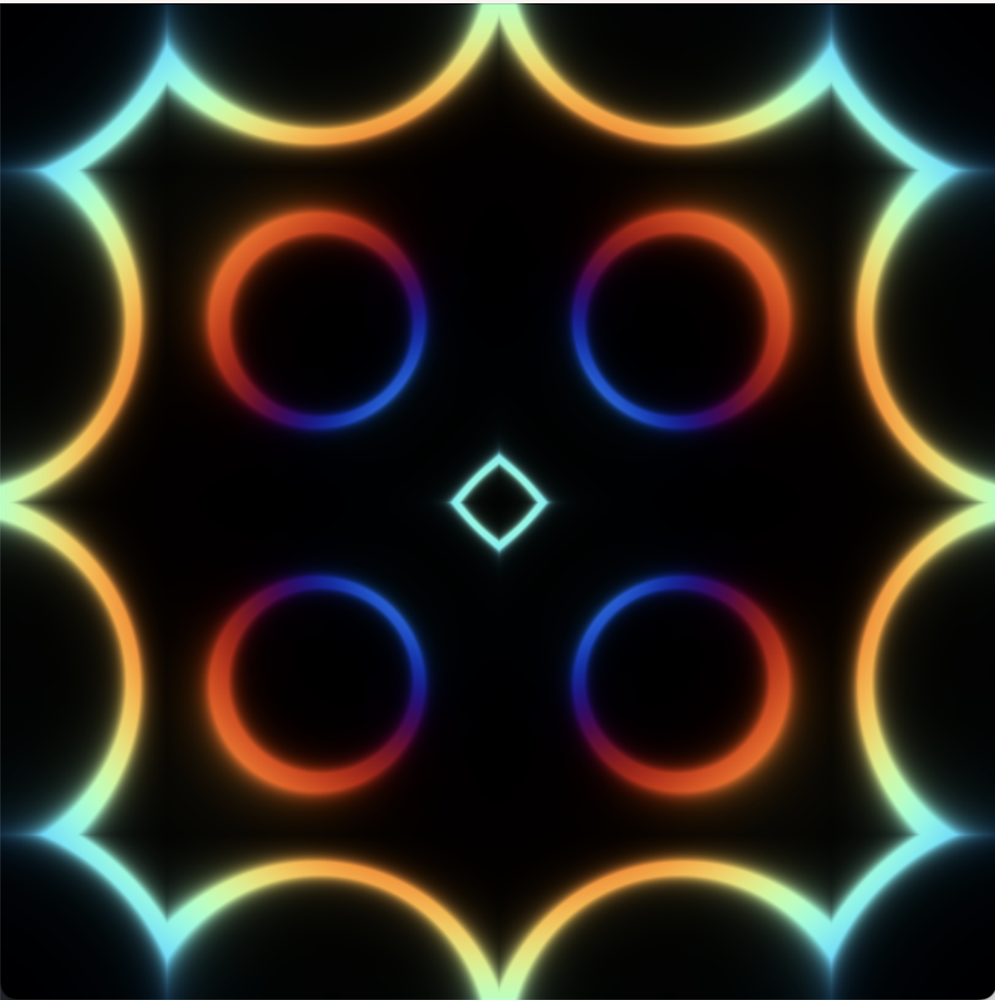
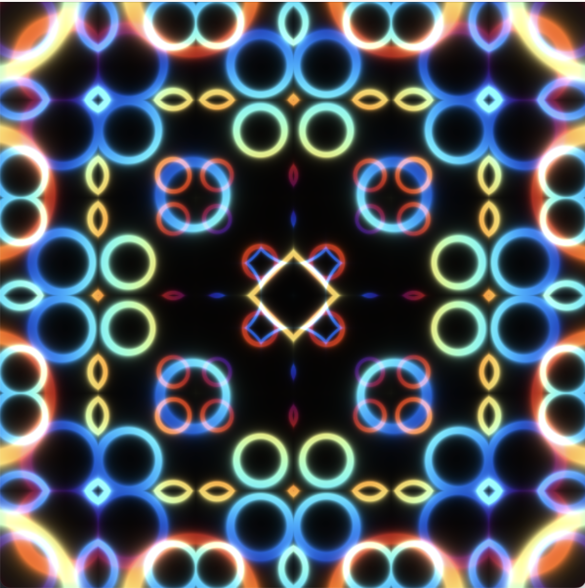

## Shader art + (minimal interaction)
This repo is the shader art coding written by C++.
As a tutorial for shader art, I watched this [youtube](https://www.youtube.com/watch?v=f4s1h2YETNY) video and learned a lot.
I converted the code into C++ with opencv support (for display and some interaction).
For color representation, I used vector classes similar to the other computer graphics program (e.g., [ray tracing](https://raytracing.github.io/books/RayTracingInOneWeekend.html#thevec3class))

For compile
```C++
make
```

Then,
```
./main
```

Interaction keys:
1. q: finish program.
2. i,k: controlling the zoom-out/in.
3. j,l: controlling the complexity of displayed arts.

Example of displayed images.


